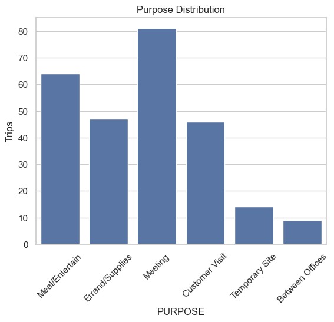
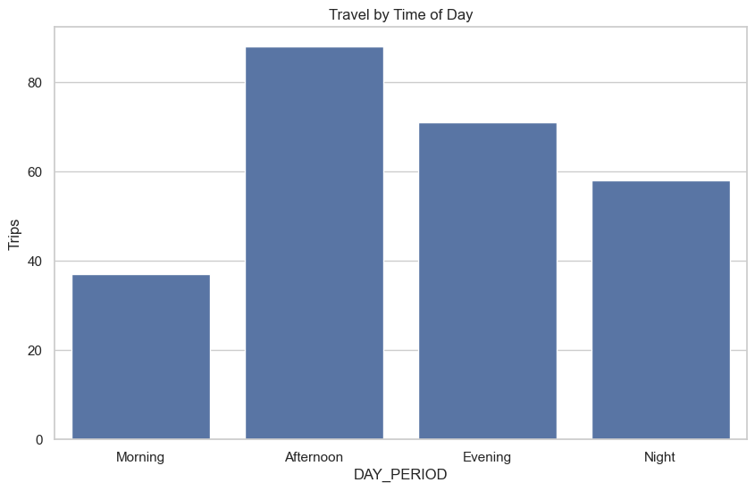
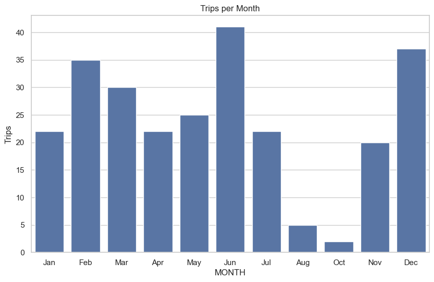
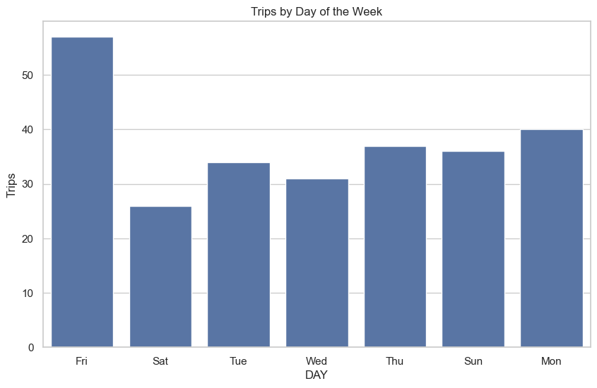
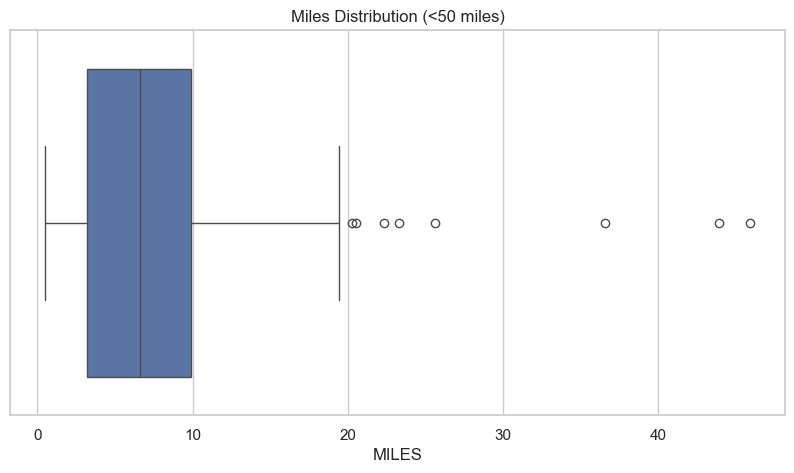
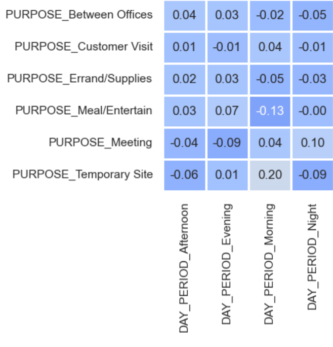
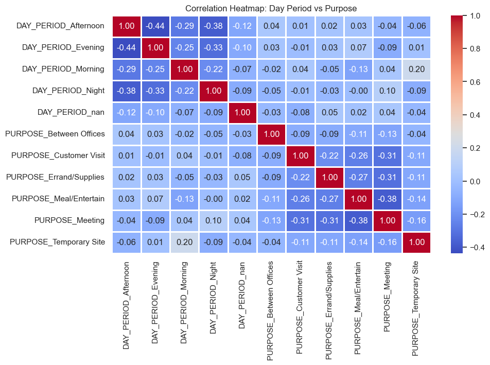

# 🚕 Uber Trip Analysis – Data Science Project

A data science project exploring **Uber trip patterns**, including trip purpose, timing, distance traveled, and trends across days and months.

---

## 📦 Dataset Overview

The dataset contains **1,156 ride records** with the following features:

* `START_DATE`: Trip start timestamp
* `END_DATE`: Trip end timestamp
* `CATEGORY`: Business or Personal
* `START`: Start location of the trip
* `STOP`: End location of the trip
* `MILES`: Distance traveled
* `PURPOSE`: Reason for the trip (e.g., Meeting, Customer Visit, Errand/Supplies)

After cleaning (removing unknown/unspecified purposes, nulls, and duplicates), **261 trips** remain for analysis.

---

## ✅ Project Workflow

1. **Data Cleaning**

   * Removed rows with `PURPOSE` as `UNKNOWN` or `NOT_SPECIFIED`
   * Converted `START_DATE` and `END_DATE` to datetime
   * Dropped nulls and duplicates

2. **Feature Engineering**

   * Extracted `DATE` and `HOUR` from `START_DATE`
   * Categorized trips into `DAY_PERIOD` (Morning, Afternoon, Evening, Night)
   * Extracted `MONTH` and `DAY` from trip dates

3. **Exploratory Data Analysis (EDA)**

   * Analyzed trip distribution by `PURPOSE`
   * Visualized trips by `DAY_PERIOD`, `MONTH`, and `DAY` of the week
   * Explored `MILES` distribution overall and under 50 miles

4. **Correlation Analysis**

   * One-hot encoded `PURPOSE` and `DAY_PERIOD`
   * Generated correlation heatmap to identify relationships between numeric features

---

## 🔍 Key Observations

1. Purpose Distribution

The majority of trips are for meetings, which indicates that people prioritize punctuality and work-related travel Trips to temporary sites and between offices are relatively rare compared to other purposes, suggesting these are less frequent or specialized types of travel.

2. Trips by Time of Day

Most trips occur during the afternoon and evening, indicating peak business activity and personal travel after work hours. There is a noticeable drop in trips during the morning, which could be due to people preparing for the day and completing fewer errands early in the day.

3. Monthly Trends

Trip frequency peaks in December and June, possibly due to holiday travel in December and mid-year business activities or events in June. There is a significant decline in trips during August and October, which could be linked to vacation periods or lower business activity during these months. The monthly pattern fluctuates, with months like April and May showing fewer trips, likely due to the absence of major events or seasonal activities.

4. Day of the Week Trends

Trips are most common on Friday, suggesting increased social and work-related travel as the week ends. There is a dip in trips on Saturday, which might be due to people planning fewer work-related trips or relying on other transport options on weekends. Overall, trips follow a relatively consistent pattern throughout the week, with minor variations linked to social and business behaviors.

5. Miles Distribution

The majority of trips are around 7 miles, indicating that people often use Uber for short journeys. A few trips exceed 10 miles, which could be due to occasional long-distance travel or cost considerations. The distribution of trip distances suggests a high percentage of trips fall between 4–10 miles, reflecting typical urban travel patterns."

6. Correlation Insights

A very strong correlation exists between temporary site visits and the morning, suggesting these trips are typically scheduled early to maximize work hours and productivity. There is a strong correlation between meetings and the night period, suggesting that meetings later in the day are common, possibly due to end-of-day wrap-ups or accommodating participants’ schedules.

No significant correlation was observed between night trips and visits to temporary sites, which implies that such visits rarely occur at night, likely due to operational or logistical constraints. There is a weak correlation between meal or entertainment trips and the morning, indicating that these trips are uncommon early in the day as most people focus on work or preparation.

---

## 📊 Visual Insights

Here are some of the key visualizations from the analysis:

### 1. Trips by Purpose

* Shows the frequency of trips for each purpose category.
* Highlights which trip types dominate business or personal travel.



---

### 2. Trips by Time of Day

* Categorizes trips into Morning, Afternoon, Evening, and Night.
* Identifies peak travel times.



---

### 3. Monthly Trip Trends

* Displays the number of trips per month.
* Useful to spot seasonal patterns or business cycles.



---

### 4. Trips by Day of the Week

* Shows how trip frequency varies across weekdays and weekends.
* Helps identify busiest days for Uber travel.



---

### 5. Miles Distribution

* Boxplot showing overall trip distances.
* Zoomed-in version (<50 miles) highlights the majority of trips.



---

### 5. Correlation Heatmap – Day Period vs Purpose

* Shows correlations between one-hot encoded DAY_PERIOD and PURPOSE.
* Useful for understanding which trip purposes are more common during different times of the day.

---

---

## 🛠️ Tech Stack

* **Python**
* Libraries: `pandas`, `numpy`, `matplotlib`, `seaborn`, `scikit-learn`

---

## 🚀 Getting Started

```bash
# 1. Clone the repository
git clone <repository_url>
cd Uber-Trip-Analysis

# 2. Install required packages
pip install -r requirements.txt

# 3. Launch the Jupyter Notebook
jupyter notebook
```

---

## 📜 License

This project is under the MIT License.

---
